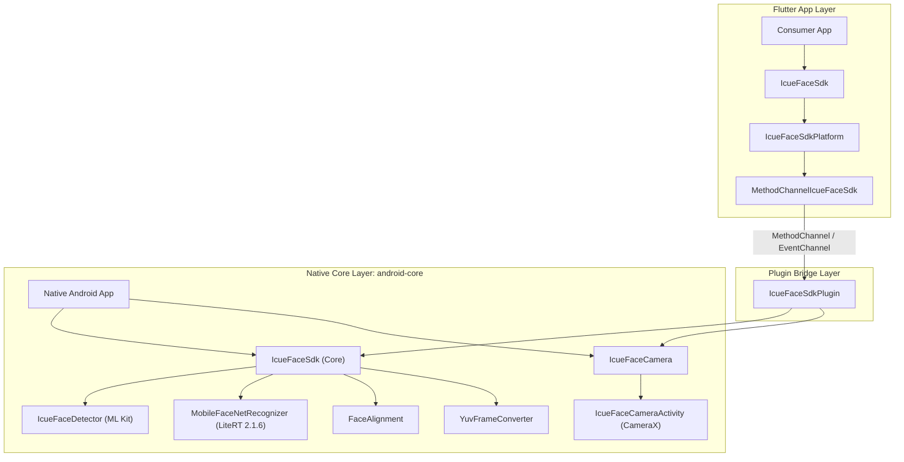

# iCue Face SDK

On-device face detection and MobileFaceNet recognition for native Android and
Flutter Android applications. Images, embeddings, and matching remain on the
device.

## Platform support

| Platform        | Support                        |
| --------------- | ------------------------------ |
| Native Android  | Android 7.0 / API 24 and newer |
| Flutter Android | Android 7.0 / API 24 and newer |
| Flutter iOS     | Not implemented                |

The pipeline uses bundled ML Kit face detection and the bundled
`mobilefacenet.tflite` model. Embeddings contain 192 normalized `float32`
values and the default cosine-similarity threshold is `0.68`.

## Architecture

The SDK follows a clean 3-tier architecture separating the Dart API, Flutter channel bridge, and standalone native Android core engine.



### Architectural Components

1. **Flutter API Layer (`lib/`)**:
   - `IcueFaceSdk`: Public Dart entry point providing async methods for embedding extraction, matching, and camera flows.
   - `IcueFaceSdkPlatform`: Platform interface enforcing contract verification via token validation.
   - `MethodChannelIcueFaceSdk`: Handles method invocation, EventChannel stream transformation, and exception mapping.

2. **Android Plugin Bridge (`android/`)**:
   - `IcueFaceSdkPlugin`: Registers Flutter MethodChannel/EventChannel, dispatches heavy operations onto background coroutines (`Dispatchers.IO`), and posts results back to the main thread loop.

3. **Standalone Native Core (`android-core/`)**:
   - Published as `school.icue:icue-face-core` for native Android apps without Flutter dependencies.
   - `IcueFaceSdk`: Thread-safe facade serializing ML Kit detection and LiteRT inference operations using Kotlin `Mutex`.
   - `MobileFaceNetRecognizer`: Manages LiteRT 2.1.6 `CompiledModel` instance with reusable tensor buffers.
   - `IcueFaceCamera` & `IcueFaceCameraActivity`: CameraX preview and frame analysis pipeline with `AtomicBoolean` frame backpressure.

## Flutter installation

During monorepo development:

```yaml
dependencies:
  icue_face_sdk:
    path: ../packages/icue_face_sdk
```

Initialize one instance and dispose it when the owning application service is
destroyed:

```dart
final sdk = IcueFaceSdk();

await sdk.initialize(
  config: const FaceSdkConfig(
    accelerator: FaceSdkAccelerator.cpu,
    numThreads: 4,
  ),
);

final embedding = await sdk.extractEmbedding(
  imagePath: imagePath,
  isFrontCamera: false,
);

final results = await sdk.recognize(
  imagePath: imagePath,
  profiles: [FaceProfile(personId: 'student-1', embedding: embedding)],
  mode: RecognitionMode.single,
);

await sdk.dispose();
```

## SDK-owned camera (Flutter)

Consumer apps do not need a camera plugin for these flows. The SDK declares and
requests the Android camera permission, opens its own full-screen preview, and
uses the same retained face model initialized above.

Capture exactly one face and receive its normalized embedding:

```dart
final embedding = await sdk.captureEmbeddingWithCamera(
  lens: CameraLens.front,
);
if (embedding == null) {
  // The user closed the camera without capturing.
}
```

Track all visible faces until the user closes the camera or the app stops it:

```dart
final subscription = sdk.faceTrackingResults.listen((frame) {
  for (final recognition in frame.recognitions) {
    if (recognition.matched) {
      print('${recognition.personId}: ${recognition.score}');
    }
  }
  for (final face in frame.faces) {
    // Coordinates are pixels in frame.frameWidth × frame.frameHeight.
    print('${face.trackingId}: ${face.left}, ${face.top}, '
        '${face.right}, ${face.bottom}');
  }
});

await sdk.startFaceTracking(
  profiles: storedProfiles,
  lens: CameraLens.front,
);

// Optional programmatic close.
await sdk.stopFaceTracking();
await subscription.cancel();
```

Subscribe before calling `startFaceTracking` so the first frames are not missed.
`trackingId` identifies the same detected face across frames within one session;
it may be `null` until ML Kit establishes a track and must not be persisted.
Only one SDK-owned camera session can be active at a time; another start fails
with `CAMERA_BUSY`. Capture requires exactly one face and keeps the preview open
when zero or multiple faces are detected.

The example app demonstrates the complete enrollment flow: capture an embedding,
associate it with a name, store it locally, and pass the restored profiles into
live recognition. Its preference-based embedding storage is for testing only;
production biometric templates should use encrypted storage and an explicit
consent and retention design.

CPU is the default accelerator, and its thread count can be omitted. GPU and
NPU can be selected explicitly with `FaceSdkAccelerator.gpu` or
`FaceSdkAccelerator.npu`. Initialization fails if the selected accelerator
cannot compile the model; the SDK never silently changes accelerator or falls
back to the Interpreter API.

## Camera frames

Packed NV21 frames can be passed to `detectFacesInFrame`,
`recognizeInFrame`, or `extractEmbeddingFromNv21`.

Flutter camera-plugin YUV420 planes use `IcueYuv420Frame`:

```dart
final frame = IcueYuv420Frame(
  yBytes: cameraImage.planes[0].bytes,
  uBytes: cameraImage.planes[1].bytes,
  vBytes: cameraImage.planes[2].bytes,
  width: cameraImage.width,
  height: cameraImage.height,
  yRowStride: cameraImage.planes[0].bytesPerRow,
  uRowStride: cameraImage.planes[1].bytesPerRow,
  vRowStride: cameraImage.planes[2].bytesPerRow,
  uPixelStride: cameraImage.planes[1].bytesPerPixel!,
  vPixelStride: cameraImage.planes[2].bytesPerPixel!,
  rotationDegrees: sensorRotation,
  mirrorHorizontally: isFrontCamera,
);

final faces = await sdk.detectFacesInYuvFrame(frame);
```

Only one camera frame is accepted at a time. A concurrent frame fails with
`IcueFaceSdkException.code == 'FRAME_BUSY'`; callers should drop that frame
instead of queueing it. The planar YUV420 converter works directly from plane
bytes without JPEG encoding, while the NV21 path uses `YuvImage` compression.

## Native Android installation

The standalone Android library is in `android-core` and publishes the Maven
coordinate `school.icue:icue-face-core:0.2.0`.

It can be included directly from this repository:

```kotlin
// settings.gradle.kts
include(":icue-face-core")
project(":icue-face-core").projectDir =
    file("../packages/icue_face_sdk/android-core")

// app/build.gradle.kts
dependencies {
    implementation(project(":icue-face-core"))
}
```

Native Kotlin usage:

```kotlin
val sdk = IcueFaceSdk(
    applicationContext,
    FaceSdkConfig(
        accelerator = FaceSdkAccelerator.CPU,
        numThreads = 4,
    ),
)

lifecycleScope.launch {
    val embedding = sdk.extractEmbedding(bitmap)
    val results = sdk.recognize(
        bitmap = bitmap,
        profiles = listOf(IcueFaceProfile("student-1", embedding)),
    )

    sdk.close()
}
```

Native apps can launch the same SDK-owned camera UI from an `Activity`:

```kotlin
IcueFaceCamera.openCapture(
    activity = this,
    sdk = sdk,
    lens = IcueCameraLens.FRONT,
    callback = object : IcueFaceCamera.CaptureCallback {
        override fun onCaptured(embedding: FloatArray) {
            // Consume the 192-value embedding.
        }

        override fun onCancelled() = Unit

        override fun onError(code: String, message: String) {
            // Surface the camera or inference error.
        }
    },
)
```

For live tracking, call `IcueFaceCamera.startTracking(...)` with an
`IcueFaceCamera.TrackingListener`. Each `onFaces` callback receives
`IcueFaceTrackingResult` containing face boxes, processed frame dimensions, and
a timestamp. Call `IcueFaceCamera.stop()` to close the active camera session.

`close()` is a suspending, idempotent operation so it cannot release the
compiled model, its tensor buffers, or ML Kit detectors while inference is
running.

## Recognition behavior

- Registration/embedding extraction requires exactly one detected face.
- `RecognitionMode.single` requires exactly one detected face.
- `RecognitionMode.multi` returns up to `maxFaces` results.
- An unmatched result keeps its best score but has a null `personId`.
- Profile IDs must be non-empty and embeddings must contain 192 finite values.
- Rotation must be `0`, `90`, `180`, or `270` degrees.

## Performance design

- One LiteRT 2.1.6 `CompiledModel` is retained for the SDK lifetime.
- CompiledModel input/output buffers and ARGB conversion arrays are reused.
- CompiledModel and detector access is serialized off the Android main thread.
- Aligned 112×112 faces skip an additional resize.
- Stored profiles are normalized once per recognition request, then matched by
  dot product.
- Static and camera bitmaps are recycled deterministically.
- Live frame backpressure prevents an unbounded inference queue.

The device integration suite prints median and p95 warm embedding latency using
the `ICUE_BENCHMARK` prefix. Collect results on representative low-, mid-, and
high-tier physical Android devices; emulator timings are not release gates.

## Verification

```bash
cd packages/icue_face_sdk
flutter analyze
flutter test --coverage

cd example
flutter build apk --debug
flutter test integration_test/plugin_integration_test.dart
```

Native core tests and AAR packaging can be run with a Gradle installation:

```bash
cd packages/icue_face_sdk/android-core
gradle test assembleRelease
```

## Privacy

Face embeddings are biometric templates. Do not log them, store them in
plaintext, include them in analytics, or transmit them without an explicit
security and consent design.
